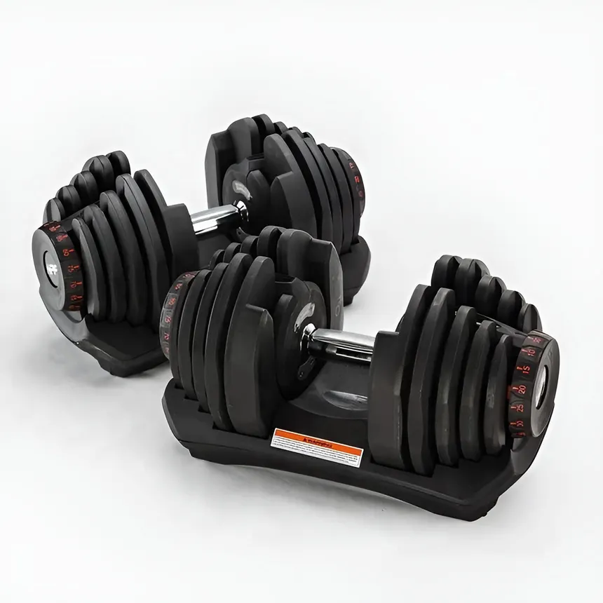
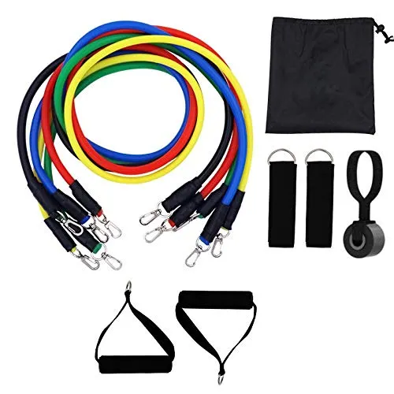
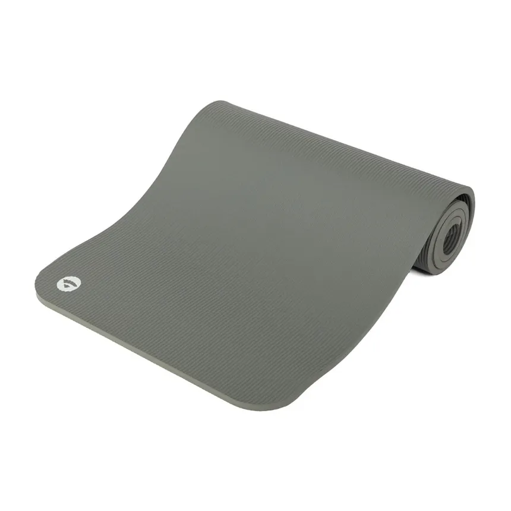

<div align="center">


# FitCorner

**E-commerce fitness moderne — équipements musculation & bien-être à domicile**

[](https://react.dev)
[](https://www.typescriptlang.org)
[](https://vitejs.dev)
[](https://tailwindcss.com)
[](https://expressjs.com)
[](https://www.sqlite.org)
[](https://stripe.com)
[](https://www.paypal.com)
[](LICENSE)

[🌐 Voir le site](https://plume-du-deen.com) · [🐛 Signaler un bug](https://github.com/bilel-k/fitcorner/issues) · [💡 Proposer une idée](https://github.com/bilel-k/fitcorner/issues)

</div>

---

## 📸 Aperçu

<div align="center">

| Accueil | Produits | Panier |
|:---:|:---:|:---:|
|  |  |  |
| Page d'accueil animée | Catalogue produits | Résumé de commande |

</div>

---

## ✨ Fonctionnalités

| Catégorie | Fonctionnalités |
|---|---|
| 🛍️ **Boutique** | Catalogue filtrable, fiches produit détaillées, recherche avancée |
| 🛒 **Panier** | Ajout/suppression, persistance locale, récapitulatif |
| 💳 **Paiement** | Stripe (carte bancaire) + PayPal, page succès/erreur |
| 👤 **Compte** | Création de compte, historique des commandes |
| ⭐ **Avis** | Système de reviews avec notes et statistiques |
| 📧 **Newsletter** | Inscription par email avec Resend |
| 🗺️ **Carte** | Localisation Google Maps intégrée |
| 📱 **Responsive** | Mobile-first, thème clair/sombre |
| 🔍 **SEO** | Balises méta dynamiques, sitemap.xml, robots.txt |
| ⚡ **Performances** | Core Web Vitals, images optimisées, lazy loading |

---

## 🗂️ Pages

```
/                   → Accueil
/products           → Catalogue complet
/halteres           → Catégorie haltères
/tapis-yoga         → Catégorie tapis de yoga
/kit-musculation    → Kits de musculation maison
/cart               → Panier
/checkout           → Commande & paiement
/orders             → Mes commandes
/conseils           → Conseils fitness
/planner            → Planificateur d'entraînement
/contact            → Contact & carte
/about              → À propos
/ramadan            → Page spéciale Ramadan
/noms-allah         → Page des 99 noms
/invocations        → Invocations
/privacy-policy     → Politique de confidentialité
/terms              → CGU
/legal-notice       → Mentions légales
/returns            → Retours & remboursements
```

---

## 🏗️ Architecture

```
fitcorner/
├── client/                  # Frontend React + Vite
│   ├── index.html
│   ├── public/
│   │   ├── images/          # Assets statiques
│   │   ├── sitemap.xml
│   │   └── robots.txt
│   └── src/
│       ├── components/      # Composants réutilisables
│       │   └── ui/          # shadcn/ui (Radix UI + Tailwind)
│       ├── pages/           # Routes de l'application
│       ├── hooks/           # Hooks personnalisés
│       ├── contexts/        # Auth, Cart, Theme
│       └── lib/             # Utils, analytics, validation
├── server/                  # Backend Express
│   ├── index.ts             # Serveur principal
│   └── database.ts          # SQLite (better-sqlite3)
├── vite.config.ts
├── tsconfig.json
└── vercel.json
```

---

## 🛠️ Stack technique

### Frontend
- **React 19** + **TypeScript 5.6**
- **Vite 7** — build ultra-rapide
- **Tailwind CSS 4** — styles utilitaires
- **shadcn/ui** (Radix UI) — composants accessibles
- **Framer Motion** — animations fluides
- **Wouter** — routing léger
- **React Hook Form** + **Zod** — formulaires typés
- **Recharts** — graphiques & statistiques

### Backend
- **Express 4** — API REST
- **better-sqlite3** — base de données locale
- **Stripe SDK** — paiement par carte
- **PayPal Server SDK** — paiement PayPal
- **Resend** — emails transactionnels

### Outils
- **pnpm** — gestionnaire de paquets
- **Vitest** + **Testing Library** — tests unitaires
- **Prettier** — formatage du code
- **Vercel** — déploiement

---

## 🚀 Démarrage rapide

### Prérequis

- [Node.js](https://nodejs.org) ≥ 18
- [pnpm](https://pnpm.io) ≥ 9

### Installation

```bash
# Cloner le dépôt
git clone https://github.com/bilel-k/fitcorner.git
cd fitcorner

# Installer les dépendances
pnpm install
```

### Variables d'environnement

Créer un fichier `.env` à la racine :

```env
# Stripe
STRIPE_SECRET_KEY=sk_test_...
VITE_STRIPE_PUBLISHABLE_KEY=pk_test_...

# PayPal
PAYPAL_CLIENT_ID=...
PAYPAL_CLIENT_SECRET=...

# Email (Resend)
RESEND_API_KEY=re_...

# App
PORT=3005
```

### Lancer en développement

```bash
# Frontend (port 5173)
pnpm dev

# Backend (port 3005) — dans un autre terminal
pnpm dev:server
```

### Build de production

```bash
pnpm build
pnpm start
```

### Tests

```bash
pnpm test          # Mode watch
pnpm test:run      # Exécution unique
pnpm test:coverage # Couverture de code
```

---

## ☁️ Déploiement

### Vercel (recommandé)

```bash
# Installer Vercel CLI
npm i -g vercel

# Déployer
vercel --prod
```

Configurer les variables d'environnement dans le dashboard Vercel : **Settings → Environment Variables**.

### GitHub Pages

```bash
pnpm deploy
```

---

## 📦 Catégories de produits

<div align="center">

| 🏋️ Haltères | 🧘 Tapis de yoga | 💪 Kit musculation |
|:---:|:---:|:---:|
|  |  |  |
| Haltères ajustables & fixes | Tapis premium antidérapants | Kits complets pour la maison |

</div>

---

## 🤝 Contribution

Les contributions sont les bienvenues !

1. Forker le dépôt
2. Créer une branche : `git checkout -b feature/ma-fonctionnalite`
3. Committer : `git commit -m 'feat: ajouter ma fonctionnalite'`
4. Pousser : `git push origin feature/ma-fonctionnalite`
5. Ouvrir une Pull Request

---

## 📄 Licence

Distribué sous licence **MIT**. Voir `LICENSE` pour plus d'informations.

---

<div align="center">

Fait avec ❤️ par [bilel-k](https://github.com/bilel-k)

⭐ N'hésitez pas à mettre une étoile si le projet vous a été utile !

</div>
